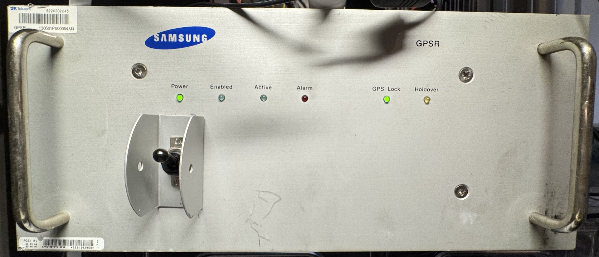
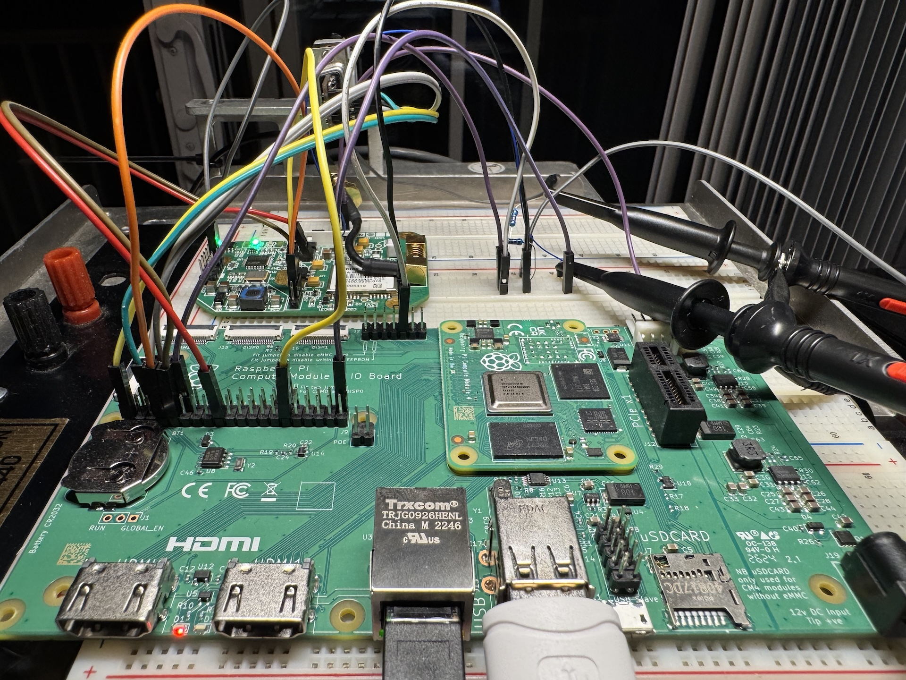
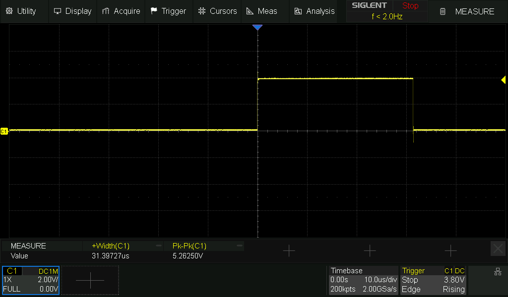
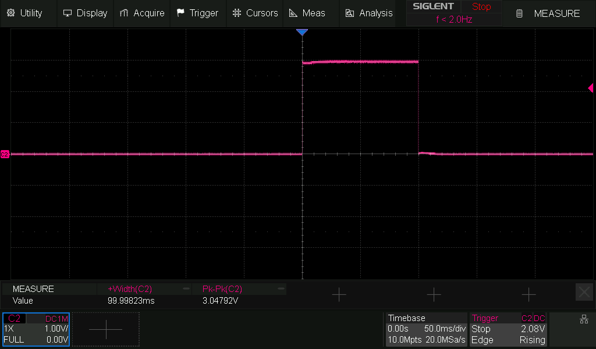

# gogpsdo - HP Z3805A chrony daemon
`gogpsdo` is a small translator for HP Z3805A GPS disciplined oscillators. Time-of-Day bytes from the GPSDO are parsed and sent to `chronyd` via the Unix domain socket driver. Chrony uses the ToD signal from `gogpsdo` along with the 1PPS signal from the GPSDO to discipline the system clock and NTP server.

For evaluation and development, the output was compared with a Nokia FYGM GNSS Receiver. This device contains a ublox LEA-M8T receiver. It was configured as a secondary source within chrony.


## Connecting the HP Z3805a to CM4
The following connections need to be made to the CM4
* Port 1 provides an interactive SCPI shell.
* Port 2 provides Time-of-Day every two seconds.
* Pulse Per Second (PPS)

The CM4 has 3v3 logic. I used a MAX232 breakout board to convert from RS232 to 3v3 logic levels. Once connected to the correct pins, `gogpsdo` receives its ToD signal via `/dev/ttyAMA0`

For PPS, a simple voltage divider was used to drop the 5V to CM4 logic levels.


### CM4 GPIO Connections
* GPIO4 - TXD3
* GPIO5 - RXD3
* GPIO14 - TXD0
* GPIO15 - RXD0
* GPIO18 - PPS0
* GPIO21 - PPS1
* SYNC_OUT - PHC


## CM4 PPS/PHC/RTC Config
Configure GPIO and overlays for CM4

`/boot/firmware/config.txt`
```
# UART
dtoverlay=disable-bt
enable_uart=1

# RTC
dtparam=i2c_vc=on
dtoverlay=i2c-rtc,pcf85063a,i2c_csi_dsi
# PPS0
dtoverlay=pps-gpio,gpiopin=18
# PPS1
dtoverlay=pps-gpio,gpiopin=21,devicename=pps1
```

Enable PPS PHC via SYNC_OUT on CM4
```
echo 1 0 | sudo tee /sys/class/ptp/ptp0/pins/SYNC_OUT
```

### Verify PPS Functionality
```
pi@cm4:~/gogpsdo $ sudo ppstest /dev/pps0
trying PPS source "/dev/pps0"
found PPS source "/dev/pps0"
ok, found 1 source(s), now start fetching data...
source 0 - assert 1757196686.001064847, sequence: 74527 - clear  0.000000000, sequence: 0
source 0 - assert 1757196687.001070380, sequence: 74528 - clear  0.000000000, sequence: 0
source 0 - assert 1757196688.001069746, sequence: 74529 - clear  0.000000000, sequence: 0
source 0 - assert 1757196689.001069279, sequence: 74530 - clear  0.000000000, sequence: 0
```


## Chrony Config Notes
```
refclock SOCK /var/run/chrony/gpsdo.sock refid GPSD stratum 1 prefer

refclock PHC /dev/ptp0:extpps poll 0 refid PPSG lock GPSD
# OR
refclock PPS /dev/pps0 refid PPSG lock GPSD poll 2
```


### Chrony SOCK
This is what hosts the unix socket within chronyd

https://gitlab.com/chrony/chrony/-/blob/master/refclock_sock.c

## Building and run gogpsdo
Build
```sh
go build -o gogpsdo gogpsdo.go
```

Run
```sh
sudo ./gogpsdo
```

### SCPI Command Reference
Set antenna cable delay
```
:GPSYSTEM:REFERENCE:ADELAY 19.5 NS
```

Get system status
```
:SYSTEM:STATUS?
```
```
------------------------------- Receiver Status -------------------------------
 
SYNCHRONIZATION ............................................. [ Outputs Valid ]
SmartClock Mode ___________________________   Reference Outputs _______________
>> Locked to GPS                              TFOM     3             FFOM     0
   Recovery                                   1PPS TI +25.3 ns relative to GPS
   Holdover                                   HOLD THR 1.000 us
   Power-up                                   Holdover Uncertainty ____________
                                              Predict  432.0 us/initial 24 hrs
                                                
ACQUISITION ............................................ [ GPS 1PPS CLK Valid ]
Satellite Status __________________________   Time ____________________________
Tracking: 2        Not Tracking: 6            UTC      00:30:36     12 Feb 2006
PRN  El  Az   SS   PRN  El  Az                1PPS CLK Synchronized to UTC
  9  44 237  106     2  14 152                ANT DLY  20 ns
 27  57  60   82   * 4  26 191                Position ________________________
                   * 7  Acq .                 MODE     Hold
                   * 8  76 155                
                   *16  Acq .                 LAT      N  40:
                    30  17 307                LON      W  76:
ELEV MASK 10 deg   *attempting to track       HGT              +158.38 m  (MSL)
HEALTH MONITOR ......................................................... [ OK ]
Self Test: OK    Int Pwr: OK   Oven Pwr: OK   OCXO: OK   EFC: OK   GPS Rcv: OK 
```

## PTP
The PHC driver can not be shared between `phc2sys` and chrony. The PPS signal from the GPSDO can be split electrically and sent through the PPS driver for chrony and through the PHC on the NIC for PTP. I'd imagine this is not ideal. Waiting to get a IEEE1588 compatible switch before evaluating PTP more.

PTP Commands
```
sudo phc2sys -s CLOCK_REALTIME -c eth0 -O 0 --step_threshold=0.5 -m
sudo ptp4l -i eth0 -f /etc/linuxptp/ptp4l.conf -m -l 7
```

## Monitoring
Telegraf can be configured to monitor chronyd. This data is sent to a VictoriaMetrics instance where it can be viewed with Grafana.

```toml
[[inputs.chrony]]
server = "udp://127.0.0.1:323"
metrics = ["activity", "tracking", "sources", "sourcestats"]
socket_group = "_chrony"
socket_perms = "0660"
```


## Hardware Pictures



## Z3805a vs UBlox PPS

HP Z3805a PPS


ublox LEA-M8T

### References
* [Is This the World's Most Accurate NTP Server Hardware?](https://www.febo.com/pages/soekris/)
* [tcl wiki - reading time-of-day from an HP/Symmetricom Z3805A GPS Disciplined Oscillator/Clock](https://wiki.tcl-lang.org/page/reading+time-of-day+from+an+HP%2FSymmetricom+Z3805A+GPS+Disciplined+Oscillator%2FClock)
* [prc68.com - HP Z3805A Time & Frequency GPS Receiver](https://prc68.com/I/Z3805A.html)
* [Jeff Geerling - PTP and IEEE-1588 hardware timestamping on the Raspberry Pi CM4](https://www.jeffgeerling.com/blog/2022/ptp-and-ieee-1588-hardware-timestamping-on-raspberry-pi-cm4)
* [James Clark - rpi-cm4-ptp-guide](https://github.com/jclark/rpi-cm4-ptp-guide)
* [John Miller - Nokia FYGM](https://wiki.millerjs.org/nokia_fygm)
